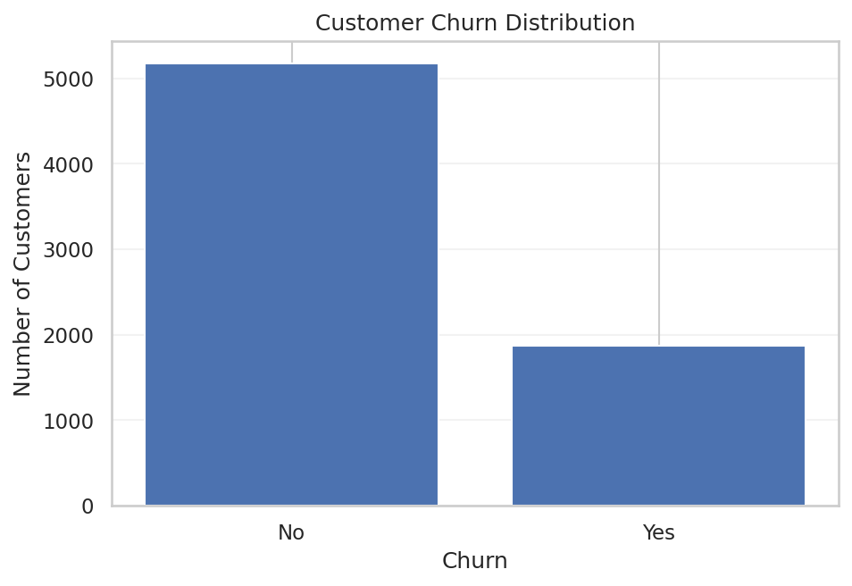
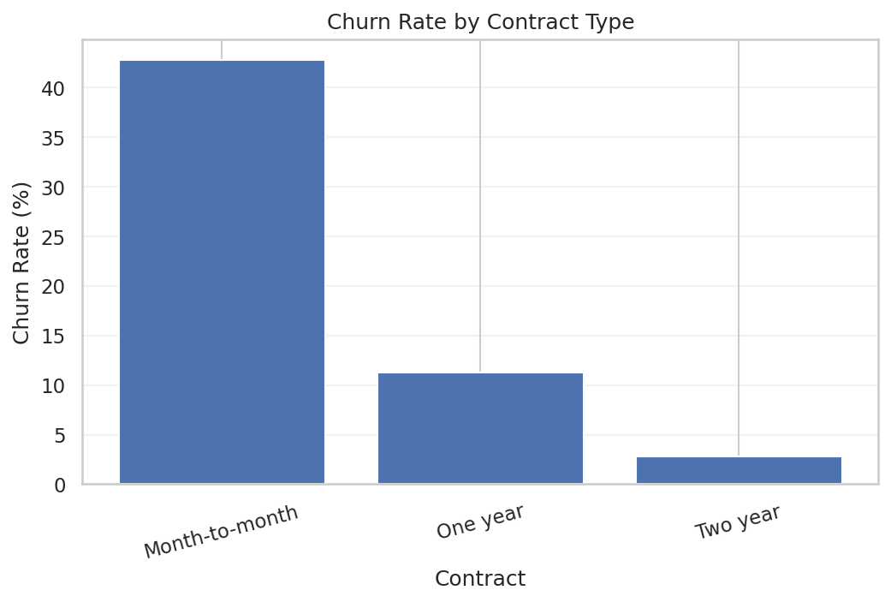
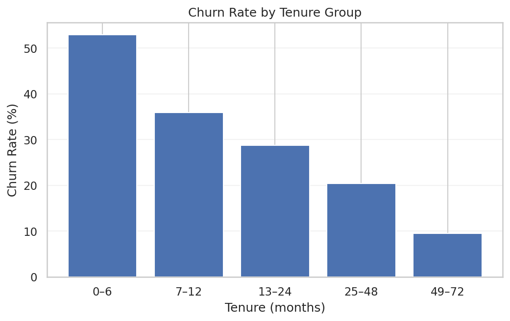
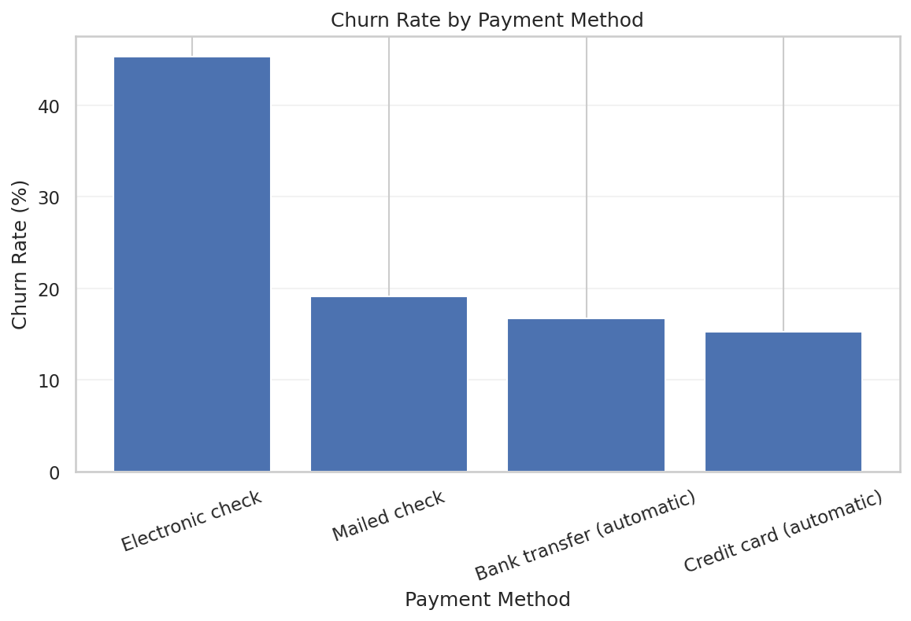
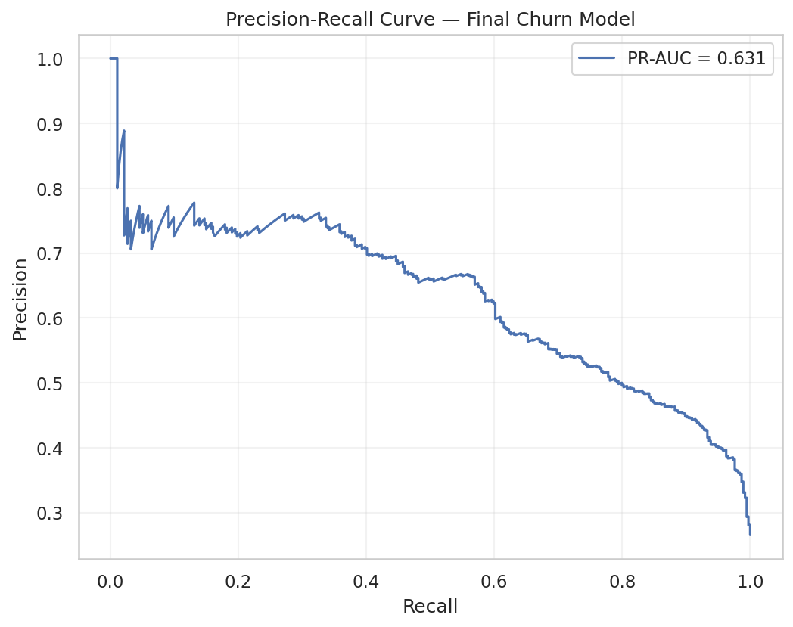
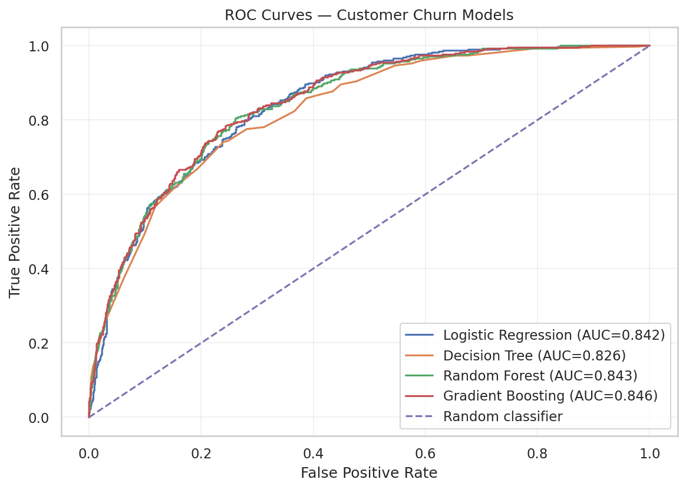
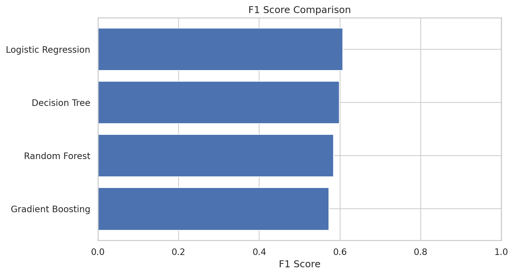
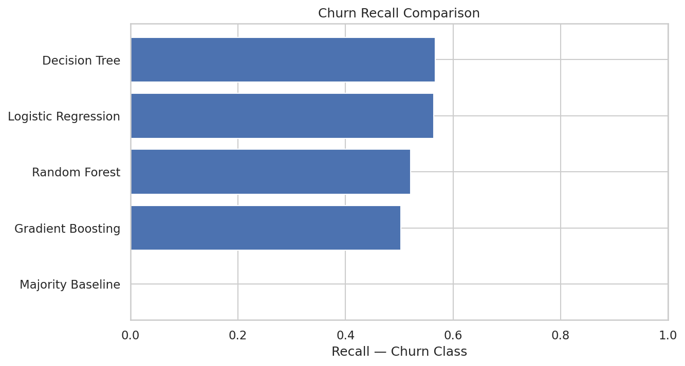
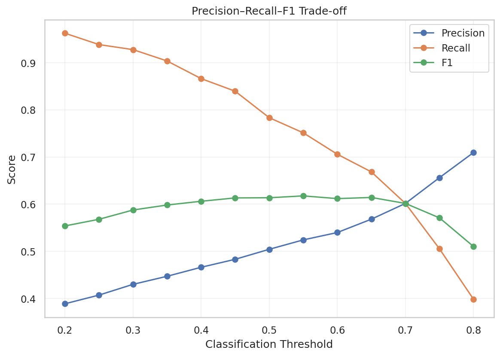
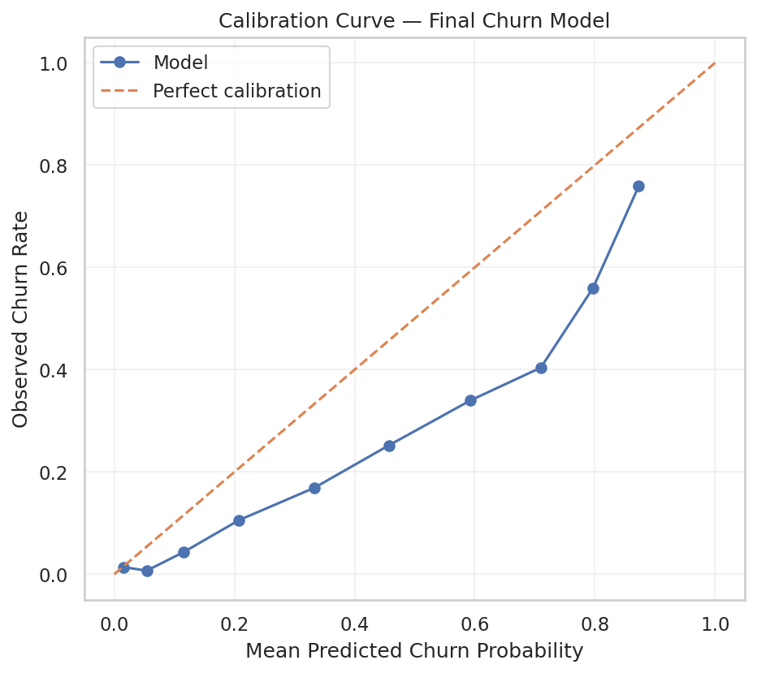

# Customer Churn Prediction — CRISP-DM Data Science Project

## 1. Project Title

**Customer Churn Prediction Using CRISP-DM and Machine Learning**

This project applies the **CRISP-DM (Cross-Industry Standard Process for Data Mining)** methodology to a telecommunications customer churn dataset and develops a binary classification model to predict whether a customer will churn.

---

## 2. Project Objective

The primary objective is to:

> **Predict whether a telecommunications customer will churn based on demographic, account, service, contract, billing, and tenure information.**

This is a **supervised binary classification problem** where:

- `Churn = Yes` → customer churned
- `Churn = No` → customer did not churn

The project also translates model results into practical customer-retention recommendations.

---

> **Project visualizations:** Key charts from the completed analysis are embedded below. Keep the `README_assets` folder in the same GitHub repository as this `README.md` file.

## 3. Dataset Description



The project uses the **Telco Customer Churn** Kaggle dataset.

The original dataset contains:

- **7,043 customer records**
- **21 variables**
- A binary target variable: `Churn`

The features describe several dimensions of the customer relationship, including:

- Demographics
- Partner/dependent status
- Tenure
- Phone and internet services
- Online security and backup services
- Device protection
- Technical support
- Streaming services
- Contract type
- Paperless billing
- Payment method
- Monthly charges
- Total charges

The target distribution is:

| Churn | Count | Percentage |
|---|---:|---:|
| No | 5,174 | 73.46% |
| Yes | 1,869 | 26.54% |

---

## 4. CRISP-DM Methodology

The project follows the six major stages of CRISP-DM:

1. **Business Understanding**
2. **Data Understanding**
3. **Data Preparation**
4. **Modeling**
5. **Evaluation**
6. **Business Recommendation**

The workflow emphasizes reproducible preprocessing, appropriate evaluation metrics, cross-validation, model comparison, threshold selection, and business interpretation.

---

## 5. Key EDA Findings

Exploratory analysis identified several strong associations with churn.

### Contract Type

| Contract | Churn Rate |
|---|---:|
| Month-to-month | **42.71%** |
| One year | **11.27%** |
| Two year | **2.83%** |

Month-to-month customers showed substantially higher observed churn.


### Tenure

| Tenure | Churn Rate |
|---|---:|
| 0–6 months | **52.94%** |
| 7–12 months | **35.89%** |
| 13–24 months | **28.71%** |
| 25–48 months | **20.39%** |
| 49–72 months | **9.51%** |

Churn declines substantially as tenure increases.



### Internet Service

| Internet Service | Churn Rate |
|---|---:|
| Fiber optic | **41.89%** |
| DSL | **18.96%** |
| No internet | **7.40%** |

### Payment Method



| Payment Method | Churn Rate |
|---|---:|
| Electronic check | **45.29%** |
| Mailed check | **19.11%** |
| Bank transfer (automatic) | **16.71%** |
| Credit card (automatic) | **15.24%** |

### Additional Observed Patterns

Other notable associations included:

- `TechSupport`: 41.64% churn without support vs. 15.17% with support
- `OnlineSecurity`: 41.77% without vs. 14.61% with security
- `PaperlessBilling`: 33.57% with paperless billing vs. 16.33% without
- `SeniorCitizen`: 41.68% vs. 23.61% for non-seniors
- Higher `MonthlyCharges` were associated with higher churn
- `tenure` had a negative association with churn, with a raw correlation of approximately **-0.352**
- `MonthlyCharges` had a positive association with churn, with a raw correlation of approximately **0.193**

These are **observed associations**, not causal conclusions.

---

## 6. Data Cleaning and Preprocessing

The following preparation steps were performed:

### `TotalCharges`

`TotalCharges` was initially stored as an `object` rather than numeric.

After conversion to numeric, **11 blank values** were identified. All 11 records had:

- `tenure = 0`
- `Churn = No`

They were treated as **0 accumulated TotalCharges** for modeling.

### Duplicate checks

- Duplicate rows: **0**
- Duplicate customer IDs: **0**

### Train/Test Split

A stratified 80/20 split was used:

- Training observations: **5,634**
- Testing observations: **1,409**

The churn rate was preserved at **26.54%** in both subsets.

### Encoding and Scaling

- `customerID` was excluded because it is an identifier rather than a meaningful predictor.
- Categorical variables were one-hot encoded.
- Numerical variables were standardized for the Logistic Regression workflow.
- Preprocessing was fit on the training data and then applied to the test data to avoid leakage.

The processed feature matrix contained:

- Training: **5,634 × 50**
- Testing: **1,409 × 50**

---

## 7. Feature Engineering and Feature Selection

Five additional features were explored:

- `AvgMonthlyCharges`
- `HasInternetService`
- `MonthToMonth`
- `AutoPayment`
- `HasTechSupport`

An ablation study showed that the engineered features did **not meaningfully improve** cross-validated performance.

| Feature Set | CV Accuracy | CV Precision | CV Recall | CV F1 | CV ROC-AUC |
|---|---:|---:|---:|---:|---:|
| Original Features | 0.7456 | 0.5132 | 0.8020 | 0.6258 | 0.8450 |
| Original + Engineered | 0.7456 | 0.5132 | 0.8015 | 0.6257 | 0.8447 |

Because the improvement was effectively zero, the analysis favors the simpler original feature representation.

### L1 Feature Selection

L1-regularized Logistic Regression reduced the encoded feature space from:

**45 → 21 features**




while retaining essentially the same predictive performance.

The strongest selected predictors included variables related to:

- Tenure
- Contract type
- Monthly charges
- Total charges
- Payment method
- Internet service
- Technical support
- Online security
- Paperless billing

---

## 8. Outlier Analysis

IQR-based outlier analysis was conducted for:

- `tenure`
- `MonthlyCharges`
- `TotalCharges`

The result was:

| Feature | IQR Outliers |
|---|---:|
| `tenure` | **0** |
| `MonthlyCharges` | **0** |
| `TotalCharges` | **0** |

The observed ranges were also plausible:

- `tenure`: 0–72 months
- `MonthlyCharges`: 18.25–118.75
- `TotalCharges`: 0–8684.80 after cleaning

No observations were removed or winsorized based on outlier analysis.

---

## 9. Baseline Model

A majority-class baseline was established using `DummyClassifier`.

Because 73.46% of customers did not churn, the baseline always predicts `No Churn`.

| Metric | Majority Baseline |
|---|---:|
| Accuracy | **73.46%** |
| Precision | **0.000** |
| Recall | **0.000** |
| F1 | **0.000** |
| ROC-AUC | **0.500** |

This demonstrates why **accuracy alone is not sufficient** for this problem.

---

## 10. Machine Learning Models

The following classifiers were evaluated:

- Logistic Regression
- Decision Tree
- Random Forest
- Gradient Boosting

Initial test-set results were:

| Model | Accuracy | Precision | Recall | F1 | ROC-AUC |
|---|---:|---:|---:|---:|---:|
| Gradient Boosting | 0.8006 | 0.6643 | 0.5027 | 0.5723 | **0.8456** |
| Random Forest | 0.8027 | 0.6633 | 0.5214 | 0.5838 | 0.8425 |
| Logistic Regression | **0.8062** | 0.6573 | 0.5642 | **0.6072** | 0.8419 |
| Decision Tree | 0.7984 | 0.6347 | **0.5668** | 0.5989 | 0.8263 |
| Majority Baseline | 0.7346 | 0.0000 | 0.0000 | 0.0000 | 0.5000 |

The models were reasonably close in overall discrimination, so model choice was not based on accuracy or ROC-AUC alone.



---

## 11. Model Evaluation and Comparison

### Cross-Validation

Five-fold stratified cross-validation was performed during model refinement.

| Model | CV Accuracy | CV Precision | CV Recall | CV F1 | CV ROC-AUC |
|---|---:|---:|---:|---:|---:|
| Logistic Regression | 0.8021 | 0.6519 | **0.5458** | **0.5934** | 0.8457 |
| Random Forest | 0.8014 | **0.6670** | 0.5050 | 0.5743 | **0.8469** |

### Class Weighting

Class-weighted Logistic Regression substantially increased churn recall:

- Precision: **50.4%**
- Recall: **78.3%**
- F1: **61.4%**
- Accuracy: **73.8%**
- ROC-AUC: **0.8417**

This shows the importance of explicitly considering class imbalance.






### Hyperparameter Tuning

Grid search for Logistic Regression selected:

```python
C = 1
class_weight = "balanced"
```

Best mean cross-validation F1:

**0.6294**

### Threshold Selection

The final operating threshold was selected using **out-of-fold training predictions**, rather than optimizing directly on the held-out test set.

The selected threshold was approximately:

**0.60**

This threshold maximized F1 on the out-of-fold training predictions.

---

## 12. Final Model Recommendation

The recommended primary model is:

**Class-weighted Logistic Regression**

with:

```python
LogisticRegression(
    C=1,
    class_weight="balanced",
    max_iter=3000,
    random_state=42
)
```

and an F1-oriented classification threshold of approximately:

**0.60**

### Why Logistic Regression?

It provides a strong combination of:

- Competitive predictive performance
- Strong churn recall
- Good F1 performance
- High ROC-AUC
- Interpretability
- Computational simplicity
- Ease of communicating results to business stakeholders

Random Forest and Gradient Boosting were competitive challenger models, but their ROC-AUC advantage over Logistic Regression was small.

---

## 13. Business Recommendations

The final model's held-out test-set results at the selected threshold were:

| Metric | Final Result |
|---|---:|
| Accuracy | **76.22%** |
| Precision — Churn | **53.99%** |
| Recall — Churn | **70.59%** |
| F1 — Churn | **61.18%** |
| ROC-AUC | **0.8417** |
| PR-AUC | **0.6323** |



The test-set confusion matrix was:

```text
                 Predicted
               No       Yes
Actual No       810      225
Actual Yes      110      264
```

### Retention interpretation

On the 1,409-customer test set:

- **489 customers** were flagged for retention
- **264 of 374 actual churners** were identified
- Churn capture rate = **70.6%**
- Churn rate among flagged customers = **54.0%**
- Baseline churn rate = **26.5%**
- Lift among flagged customers = approximately **2.03×**

This suggests that the model can be used as a **retention-prioritization tool**, concentrating customers with higher observed churn risk.

### Recommended business use

A practical deployment could segment customers into different risk groups and prioritize retention resources toward customers with the highest predicted risk.

Particular attention should be paid to combinations of characteristics associated with elevated churn risk, such as:

- Short tenure
- Month-to-month contracts
- Electronic-check payment
- Certain internet/service configurations
- Lack of technical support or online security

These are predictive associations and should not be interpreted as proof that any individual feature causes churn.

### Threshold and cost considerations

The appropriate operating threshold should eventually depend on:

- Cost of retention interventions
- Cost of false positives
- Cost of missed churners
- Customer lifetime value
- Retention-team capacity

The analysis therefore recommends the approximately **0.60 F1-oriented threshold** as a starting operating point, not as a universal business optimum.

---

## 14. Key Limitations

Several limitations should be considered:

1. **The dataset represents a specific telecommunications customer population.** Results may not generalize directly to other companies or time periods.

2. **The analysis is observational.** The model identifies predictive associations but does not establish causation.

3. **The test set is a single held-out sample.** Future deployment should include prospective validation and ongoing monitoring.

4. **Probability calibration is not perfect.**

 The model is more appropriate for risk ranking/classification than treating every predicted probability as perfectly calibrated.

5. **Actual business costs were not provided.** Therefore, threshold selection was based on F1-oriented model development rather than a true financial cost function.

6. **The project does not include a live deployment pipeline.** Production implementation would require additional monitoring, retraining, data validation, and governance.

---

## 15. AI-Assisted Development / Use of ChatGPT

ChatGPT was used as an **AI-assisted data science and instructional support tool** during the project.

Its role included:

- Supporting the application of the CRISP-DM methodology
- Structuring the analysis into logical stages
- Assisting with Python/scikit-learn workflow development
- Explaining data-science concepts and modeling decisions
- Helping interpret model evaluation results
- Supporting visualization and business interpretation
- Consolidating the completed work into the final Jupyter Notebook and GitHub documentation

The analysis was performed on the uploaded dataset using executed Python code, and the reported metrics, outputs, and conclusions are based on the resulting analysis.

---

## 16. Project Resources

### Jupyter Notebook

`telco_customer_churn_crisp_dm_final.ipynb`

### Medium Article

https://medium.com/@arsalan.syed_11850/predicting-telecom-customer-churn-with-crisp-dm-and-machine-learning-5f3d994e6397

### YouTube Video

**[PLACEHOLDER — INSERT YOUTUBE VIDEO LINK HERE]**

---

## Final Summary

This project followed the CRISP-DM methodology from business understanding through final business recommendation.

The final recommended solution is a **class-weighted Logistic Regression model** with approximately a **0.60 F1-oriented classification threshold**.

On the held-out test set, the model achieved:

- **76.22% accuracy**
- **53.99% churn precision**
- **70.59% churn recall**
- **61.18% churn F1**
- **0.8417 ROC-AUC**
- **0.6323 PR-AUC**

The model identifies approximately **71% of observed churners** at the selected operating point and produces approximately **2.03× lift** among customers flagged for retention.

The main predictive signals were associated with **tenure, contract structure, charges, payment behavior, internet/service configuration, and support/security services**.

